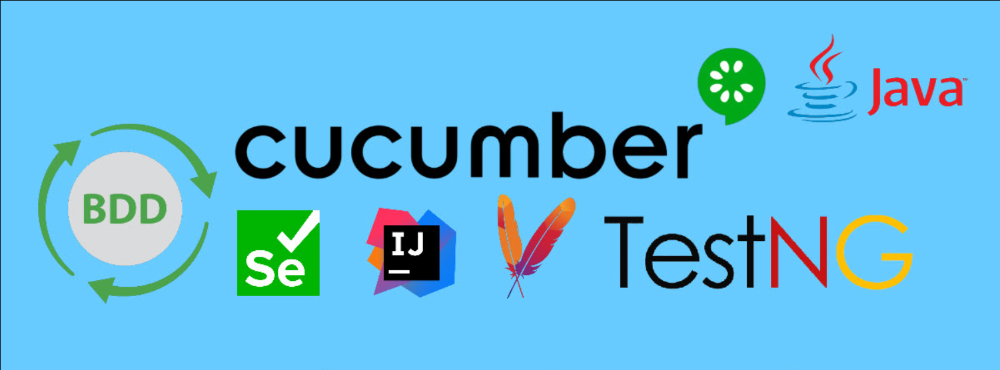
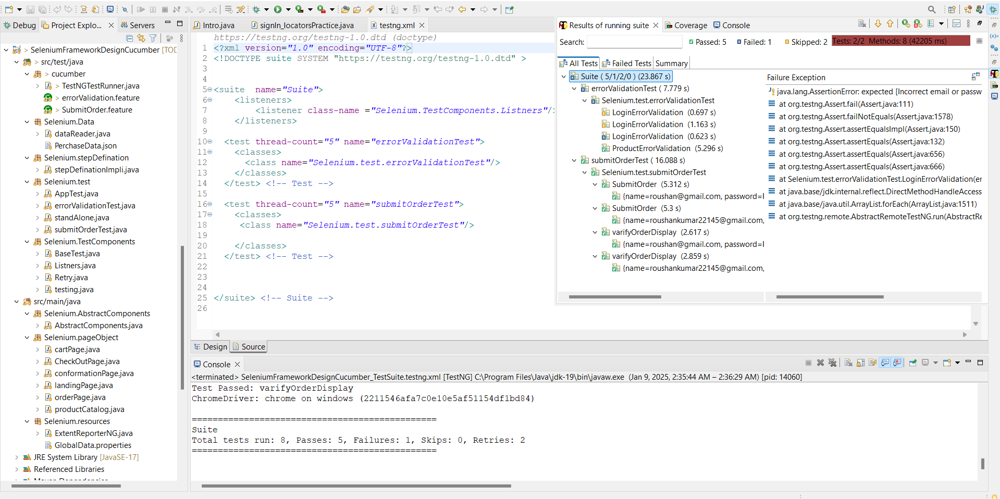
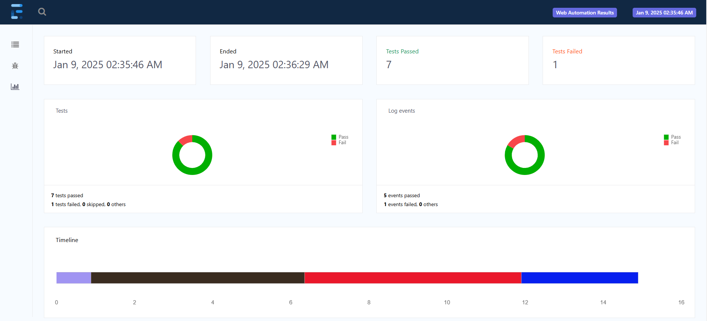
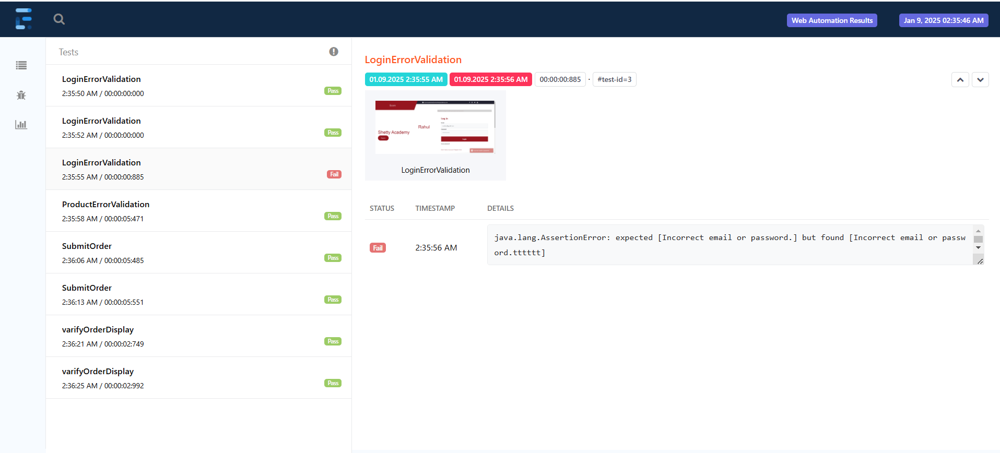

# Robust Automation Testing Framework

<!--   -->




This project is a **robust automation testing framework** built using **Java**, **Selenium WebDriver**, **TestNG**, and **Cucumber**. It integrates the strengths of **TestNG** for test execution and **Cucumber** for behavior-driven development (BDD), providing a **hybrid solution** for efficient and comprehensive UI automation testing.

---

## 🚀 **Framework Features**

### 🔄 **Parallel Execution**
Run multiple test cases simultaneously to save time.

### 📊 **Data-Driven Testing**
Ensure versatile test coverage by leveraging test data from external sources.

### 📝 **Behavior-Driven Development (BDD)**
Facilitate easy collaboration with stakeholders using Cucumber's Gherkin syntax.

### 📋 **Detailed Reporting**
Generate customizable and visually appealing test reports using **ExtentReports**.

### 🌐 **Git Integration**
Seamlessly integrate with **Git** for version control and enable CI/CD pipelines.

### 🔧 **Modular Design**
Follow **OOP principles** to enhance maintainability and scalability.

---

## 📂 **Project Structure**

```plaintext
src/main/java
├── Selenium.AbstractComponents
│   ├── AbstractComponents.java
├── Selenium.pageObject
│   ├── cartPage.java
│   ├── CheckOutPage.java
│   ├── conformationPage.java
│   ├── landingPage.java
│   ├── orderPage.java
│   ├── productCatalog.java
├── Selenium.resources
    ├── ExtentReporterNG.java
    ├── GlobalData.properties

src/test/java
├── cucumber
│   ├── TestNGTestRunner.java
│   ├── errorValidation.feature
│   ├── SubmitOrder.feature
├── Selenium.Data
│   ├── dataReader.java
│   ├── PurchaseData.json
├── Selenium.stepDefinition
│   ├── stepDefinitionImpl.java
├── Selenium.test
│   ├── AppTest.java
│   ├── errorValidationTest.java
│   ├── standAlone.java
│   ├── submitOrderTest.java
├── Selenium.TestComponents
    ├── BaseTest.java
    ├── Listeners.java
    ├── Retry.java
    ├── testing.java

TestSuite
├── ErrorValidation.xml
├── purchase.xml
├── testng.xml
├── testng2.xml

reports
├── reports1

pom.xml
```

---

## 🛠️ **Technologies Used**

- **Java**: Programming language for core development.
- **Selenium WebDriver**: Browser automation tool.
- **TestNG**: Test execution framework.
- **Cucumber**: BDD framework.
- **ExtentReports**: Reporting tool.
- **Git**: Version control system.

---

## 📊 **Test Report Example**

<!--  -->



---

## ⚙️ **Setup Instructions**

1. **Clone the repository**:
   ```bash
   git clone https://github.com/Roushan7970835758/SeleniumFrameworkDesign_TestNg_Cucumber.git
   ```

2. **Navigate to the project directory**:
   ```bash
   cd SeleniumFrameworkDesign_TestNg_Cucumber
   ```

3. **Install dependencies**:
   Ensure you have Maven installed, then run:
   ```bash
   mvn clean install
   ```

4. **Run the tests**:
   Execute tests using Maven:
   ```bash
   mvn test -PRegression
   ```

---

## 📌 **Key Benefits**

- **End-to-End Automation**: Ensures reliable software delivery.
- **Comprehensive Coverage**: Handles complex workflows with ease.
- **Best Practices**: Demonstrates industry-standard testing techniques.

---

## 🌟 **Contributing**

Contributions are welcome! Please create a pull request or open an issue for any enhancements or bugs.

---


